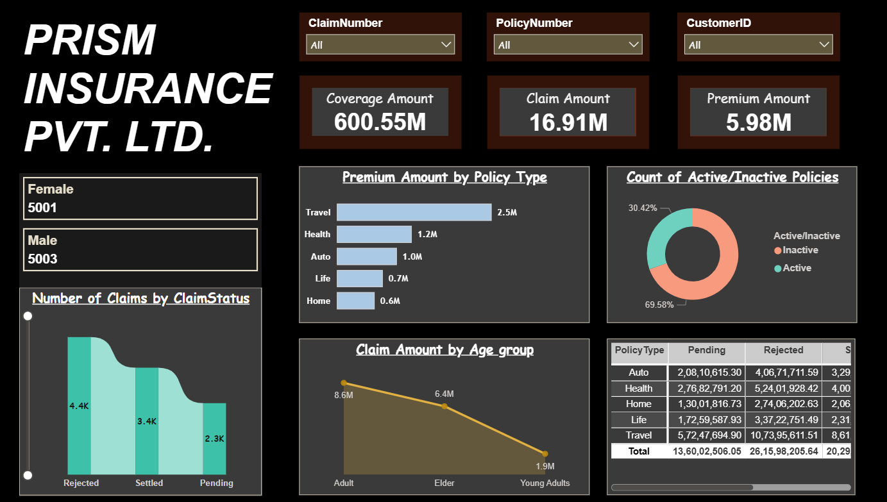

# 📊 Prism Insurance Dashboard (Power BI)

##  Overview

This project showcases an interactive Power BI dashboard built to analyze insurance data across coverage, claims, premiums, and customer demographics.

The dashboard enables business users to monitor performance, identify trends, and gain actionable insights.

---

## 🎯 Objectives

* Analyze overall insurance performance
* Track claim status distribution
* Compare premium contribution across policy types
* Understand customer segmentation (gender & age group)
* Monitor active vs inactive policies

---

## 📌 Key Metrics

* 💰 Total Coverage Amount: **600.55M**
* 📉 Total Claim Amount: **16.91M**
* 💵 Total Premium Amount: **5.98M**

---

## 📊 Dashboard Features

### 🔹 Filters (Slicers)

* Claim Number
* Policy Number
* Customer ID

### 🔹 KPI Cards

* Coverage Amount
* Claim Amount
* Premium Amount

### 🔹 Visualizations

* Premium Amount by Policy Type (Bar Chart)
* Active vs Inactive Policies (Donut Chart)
* Number of Claims by Status (Area Chart)
* Claim Amount by Age Group (Line Chart)
* Policy-wise Claim Details (Table)
* Gender Distribution (Multi row card)

---

## 🔍 Key Insights

* ✈️ Travel policies generate the highest premium revenue
* 📊 Majority of policies are active (~70%)
* 👥 Adults contribute the highest claim amount
* 📉 Pending claims are lower compared to rejected and settled
* 🚗 Auto and Health policies show higher rejected claims

---

## 📷 Dashboard Preview

---

## 🛠️ Tools Used

* Power BI
* MS SQL Server
* Data Modeling

---

## 📂 Project Files

* insurance_analysis.pbix
* InsuranceData.csv
* dashboard.png

---

## 🚀 How to Use

1. Download the `.pbix` file
2. Open in Power BI Desktop
3. Use slicers to interact with the dashboard

---

## 👩‍💻 Author

**Maroofa**
Aspiring Data Analyst
